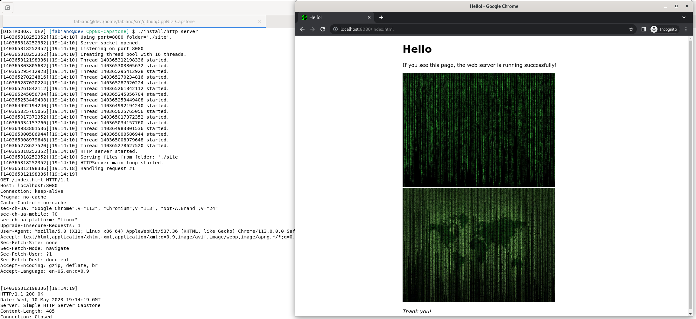

# CppND Capstone Project - Simple HTTP Server

This is my capstone project in the [Udacity C++ Nanodegree Program](https://www.udacity.com/course/c-plus-plus-nanodegree--nd213). 

For the capstone, I have decided to implement a (simple) HTTP server.  An HTTP server is a well-known application, and offers excelent grounds for showcasing the OOP, Memory Management and Concurrency topics explored throughout the course.

## Overview

Of course, implementing a full-fledged HTTP server from scratch would be too big of a challenge and would extend far beyond the purpose of this capstone. 

So, for this course project, we have narrowed down our scope as to implement a basic HTTP server with the minimum set of capabilities enough to serve a static website using HTTP/1.1. Only the HTTP GET and HEAD methods are supported.

The HTTP/1.1 protocol is defined in RFCs [7230](http://www.rfc-editor.org/info/rfc7230), [7231](http://www.rfc-editor.org/info/rfc7231), 
[7232](http://www.rfc-editor.org/info/rfc7232), [7233](http://www.rfc-editor.org/info/rfc7233), 
[7234](http://www.rfc-editor.org/info/rfc7234) and [7235](http://www.rfc-editor.org/info/rfc7235).

## System Requirements

The project was developed/tested on Debian 11 (Bullseye) and Arch Linux, but it should compile and run fine on any Linux distribution.

## Build Dependencies 

* cmake >= 3.18
  * Debian: `sudo apt install cmake`
  * Arch: `sudo pacman -S cmake`
* make >= 4.3 
  * Debian: `sudo apt install make`
  * Arch: `sudo pacman -S make`
* gcc/g++ >= 10.2
  * Debian: `sudo apt install g++`
  * Arch: `sudo pacman -S gcc`
* boost >= 1.74
  * Debian: `sudo apt install libboost-all-dev`
  * Arch: `sudo pacman -S boost`
* clang-tidy >= 11.0.1
  * Debian: `sudo apt install clang-tidy`
  * Arch: `sudo pacman -S clang`
* astyle >= 3.1
  * Debian: `sudo apt install astyle`
  * Arch: `sudo pacman -S astyle`  

## Basic Build Instructions

The project can be build using `make <target>`.  The Makefile has five targets:

* `build`: compiles the source code and generates an executable.
* `debug`: compiles the source code and generates an executable, including debugging information.
* `clean`: deletes the `build/` and `install/`  directories, i.e., cleans the build artifacts.
* `format`: formats the source code using the `astyle` tool.

## Running the Server

In order to run the resulting executable manually: 

`./install/http_server --port=<port> --folder=<folder>` 

Where `port` should be the port to listen on and `folder` should be the path to a directory containing the files to be served.  These options are not mandatory and defaults to `8080` and `./site` respectivelly.

The `./site` folder contains a (very) simple web site for demonstration purposes.

Then with the server running, open a web browser and point to `http://localhost:<port>`, where  `port` should be the port the server is listening on.

To interrupt the server, press `Ctrl+C`.

## Project Rubric

These are the rubric items addressed by this project:

**README**

- [x] A README with instructions is included with the project.
- [x] The README indicates which project is chosen.
- [x] The README includes information about each rubric point addressed. 

**Compiling and Testing**
- [x] The submission must compile and run.

**Loops, Functions, I/O**
- [x] The project demonstrates an understanding of C++ functions and control structures.
- [x] The project reads data from a file and process the data, or the program writes data to a file. [Example here.](https://github.com/pragmaerror/CppND-Capstone/blob/17496697a881dc024034d286fc9cf99855903b32/src/lib/http_server/getmethodhandler.cpp#L100)
- [x] The project accepts user input and processes the input. [Example here.](https://github.com/pragmaerror/CppND-Capstone/blob/17496697a881dc024034d286fc9cf99855903b32/src/app/main.cpp#L37)

**Object Oriented Programming**
- [x] The project uses Object Oriented Programming techniques. 
- [x] Classes use appropriate access specifiers for class members.
- [x] Class constructors utilize member initialization lists. [Example here.](https://github.com/pragmaerror/CppND-Capstone/blob/17496697a881dc024034d286fc9cf99855903b32/src/lib/http_server/httpserver.cpp#L10)
- [x] Classes abstract implementation details from their interfaces. [Example here.](https://github.com/pragmaerror/CppND-Capstone/blob/17496697a881dc024034d286fc9cf99855903b32/src/lib/http_server/methodhandler.hpp#L24)
- [x] Classes encapsulate behavior. 
- [x] Classes follow an appropriate inheritance hierarchy. 
- [ ] Overloaded functions allow the same function to operate on different parameters.
- [x] Derived class functions override virtual base class functions. [Example here.](https://github.com/pragmaerror/CppND-Capstone/blob/17496697a881dc024034d286fc9cf99855903b32/src/lib/http_server/headmethodhandler.hpp#L25)
- [x] Templates generalize functions in the project. [Example here.](https://github.com/pragmaerror/CppND-Capstone/blob/17496697a881dc024034d286fc9cf99855903b32/src/lib/logger/logger.hpp#L39)

**Memory Management**
- [x] The project makes use of references in function declarations. [Example here.](https://github.com/pragmaerror/CppND-Capstone/blob/17496697a881dc024034d286fc9cf99855903b32/src/lib/http_server/requesthandler.cpp#L15)
- [x] The project uses destructors appropriately. [Example here.](https://github.com/pragmaerror/CppND-Capstone/blob/17496697a881dc024034d286fc9cf99855903b32/src/lib/http_server/methodhandler.hpp#L22)
- [x] The project uses scope / Resource Acquisition Is Initialization (RAII) where appropriate. [Example here.](https://github.com/pragmaerror/CppND-Capstone/blob/17496697a881dc024034d286fc9cf99855903b32/src/lib/http_server/serversocket.cpp#L15)
- [x] The project follows the Rule of 5. [Example here.](https://github.com/pragmaerror/CppND-Capstone/blob/17496697a881dc024034d286fc9cf99855903b32/src/lib/http_server/requestsocket.hpp#L26)
- [x] The project uses move semantics to move data, instead of copying it, where possible. [Example here.](https://github.com/pragmaerror/CppND-Capstone/blob/17496697a881dc024034d286fc9cf99855903b32/src/lib/http_server/httpserver.cpp#L66)
- [x] The project uses smart pointers instead of raw pointers. [Example here.](https://github.com/pragmaerror/CppND-Capstone/blob/17496697a881dc024034d286fc9cf99855903b32/src/lib/http_server/httpserver.cpp#L66)

**Concurrency**
- [x] The project uses multithreading. [Example here.](https://github.com/pragmaerror/CppND-Capstone/blob/17496697a881dc024034d286fc9cf99855903b32/src/lib/threadpool/threadpool.hpp#L27)
- [x] A promise and future is used in the project. [Example here.](https://github.com/pragmaerror/CppND-Capstone/blob/17496697a881dc024034d286fc9cf99855903b32/src/lib/http_server/httpserver.cpp#L36)
- [x] A mutex or lock is used in the project. [Example here.](https://github.com/pragmaerror/CppND-Capstone/blob/cb81708dc54448534d03638e35b77e54242a2aca/src/lib/logger/logger.hpp#L38)
- [x] A condition variable is used in the project. [Example here.](https://github.com/pragmaerror/CppND-Capstone/blob/17496697a881dc024034d286fc9cf99855903b32/src/lib/threadpool/threadpool.hpp#L110)

  

